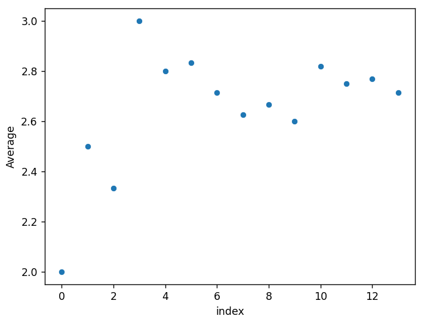
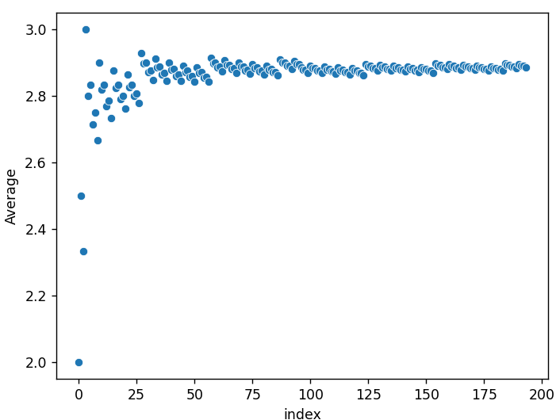
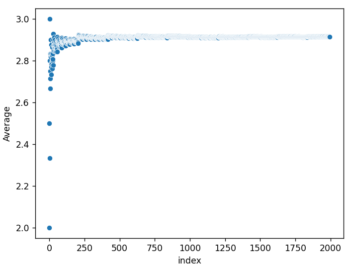
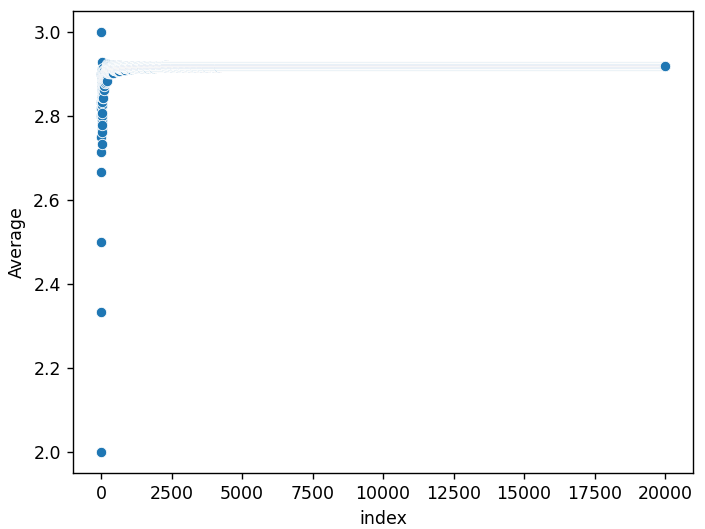
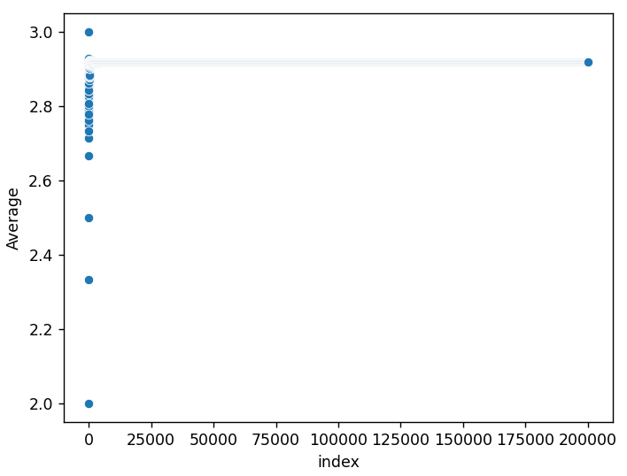

# prime-constant
A short script that computes the constant discussed in [this video](https://www.youtube.com/watch?v=_gCKX6VMvmU). 

## Plotting the Average as $n \to \infty$
Scatterplot of the first 14 averages:

Scatterplot of the first 194 averages:

Scatterplot of the first 1,994 averages:

Scatterplot of the first 19,994 averages:

Scatterplot of the first 199,994 averages:
